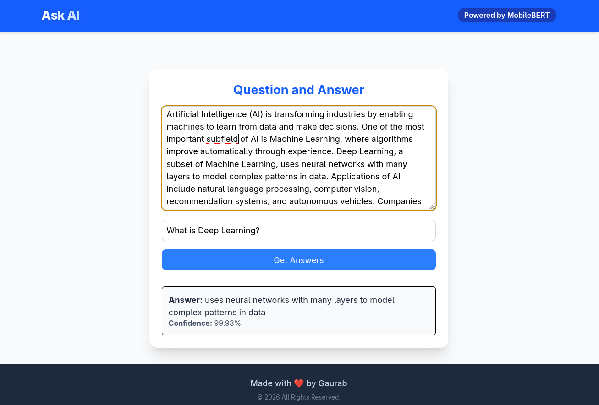

# Ask-AI: Client-Side Document Analyzer

Ask-AI is a browser-based Question and Answer application. It leverages TensorFlow.js and the MobileBERT architecture to run complex Natural Language Processing (NLP) inference entirely on the client-side. 

By executing the ML model directly in the browser, Ask-AI ensures **100% data privacy**—no text or context is ever sent to an external server.

**👉 [Try the Live Application Here](https://gaurabsingh012.github.io/Ask-AI/)**

## 📸 Preview

## ✨ Key Features

* **Zero-Server Inference:** The ~45MB MobileBERT model is loaded directly into the browser's memory, utilizing WebGL/WebGPU for hardware-accelerated text analysis.
* **Persistent Memory Model:** Implements React `useRef` to hold the massive tensor graph outside the render cycle, preventing memory leaks and UI freezing during keystrokes.
* **Logit Normalization:** Converts raw model outputs (logits) into intuitive relative probability percentages using Exponential (Softmax-like) scaling.
* **Overlapping Span Filtering:** Automatically deduplicates nested or heavily overlapping text spans generated by the BERT token evaluator.
* **Fully Responsive:** Built with Tailwind CSS v4 and a flexible layout system optimized for both desktop and mobile viewing.

## 🛠️ Tech Stack

* **Frontend Framework:** React 19 + TypeScript
* **Build Tool:** Vite
* **Styling:** Tailwind CSS v4
* **Machine Learning:** `@tensorflow/tfjs` & `@tensorflow-models/qna`
* **Hosting:** GitHub Pages

## 🧠 Under the Hood: The ML Logic

The core of this application relies on a pretrained MobileBERT model fine-tuned on the SQuAD (Stanford Question Answering Dataset). 

Instead of generating text from scratch (like an LLM), this model evaluates the provided context and predicts the most mathematically probable **start token** and **end token** that answers the user's question. The raw scores are then normalized into a $0-100\%$ confidence scale representing the relative probability of the extracted span compared to other possible answers in the text.

## 👤 Author

**Gaurab Kushwaha**
* GitHub: [@GaurabSingh012](https://github.com/GaurabSingh012)
* Live Site: [Ask-AI](https://gaurabsingh012.github.io/Ask-AI/)